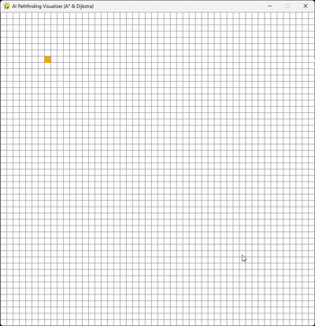

# AI Pathfinding Visualizer

A Python-based visualization tool that demonstrates how pathfinding algorithms calculate the shortest route between two points. Built with Pygame, this application allows users to draw custom grid environments with obstacles and watch algorithms like A* (A-Star) and Dijkstra's evaluate nodes in real-time to find the optimal path.



## 🧠 Algorithms Included

* **A* (A-Star) Search Algorithm:** A highly efficient pathfinding algorithm that uses a heuristic (Manhattan distance) to guide its search towards the target, minimizing the number of nodes evaluated.
* **Dijkstra's Algorithm:** A classic algorithm that guarantees the shortest path by exploring all possible directions equally (functionally A* with a heuristic of 0).

## 🎨 Color Legend

* 🟧 **Orange:** Start Node
* 🟦 **Turquoise:** End Node
* ⬛ **Black:** Wall / Barrier Node
* 🟩 **Green:** Open Set (Node currently queued for evaluation)
* 🟥 **Red:** Closed Set (Node already evaluated)
* 🟪 **Purple:** The Final Shortest Path

## 🎮 Controls

* **Left-Click:** 
  * 1st Click: Place the Start Node.
  * 2nd Click: Place the End Node.
  * 3rd+ Clicks (or drag): Draw Barriers/Walls.
* **Right-Click:** Erase the node under the cursor.
* **Key `A`:** Start the **A*** Algorithm.
* **Key `D`:** Start **Dijkstra's** Algorithm.
* **Key `C`:** Clear the entire board and reset the grid.

## 🛠️ Installation & Setup

### Prerequisites
Make sure you have [Python 3.x](https://www.python.org/downloads/) installed on your machine.

### Instructions

1. Clone this repository to your local machine:

   ```bash
   git clone [https://github.com/narvekar/AI-Pathfinding-Visualizer.git](https://github.com/narvekarmahin/AI-Pathfinding-Visualizer.git)
    ```
2. Navigate to the project directory:

   ```bash
   cd AI-Pathfinding-Visualizer
   ```
3. Install the required dependencies:

   ```bash
   pip install -r requirements.txt
   ```
4. Run the application:

   ```bash
   python pathfinding_visualizer.py
